### 💻 Desenvolvedor em formação • Engenharia de Software • Técnico em Informática

  
  

---

## 🧑‍💻 Quem sou eu

> **Transformando aprendizado em projetos e projetos em experiência.**

Sou **Técnico em Informática** e estudante de **Bacharelado em Engenharia de Software**.

Minha trajetória é voltada para tecnologia e desenvolvimento de software. Gosto de aprender construindo: cada projeto é uma oportunidade para praticar programação, resolver problemas e entender melhor como sistemas são planejados e desenvolvidos.

### 🔎 Atualmente estou focado em

- 🐍 **Python** e lógica de programação
- 🌐 **Desenvolvimento Web**
- 🗄️ **Banco de Dados e SQL**
- 🧩 **Estruturas de Dados e Algoritmos**
- ⚙️ **Engenharia de Software**
- 🔧 **Git e GitHub**

---

## 🛠️ Tecnologias

### Linguagens & Web

### Banco de Dados & Ferramentas

---

## 🤖 Ferramentas de IA

### Inteligência Artificial

  
  
  

---

## 🚀 Projetos

### 💰 Finanças Fácil

> Aplicação desenvolvida para praticar lógica de programação e gerenciamento financeiro.

**Funcionalidades**
- 💵 Saldo inicial
- 📈 Receitas
- 📉 Despesas
- 💎 Investimentos
- 👤 Usuários
- 📋 Histórico financeiro

`Python` `Estruturas de Dados` `Lógica de Programação`

---

### 🐾 Sistema para Pet Shop

> Projeto conceitual focado em solucionar problemas de organização de um pet shop.

**Funcionalidades planejadas**
- 👤 Clientes e animais
- 📅 Agendamentos
- 💉 Controle de vacinação
- 💰 Controle financeiro
- 📋 Histórico de atendimentos

`Web` `Banco de Dados` `Engenharia de Software`

---

### 🌐 Projetos Web

Também desenvolvo páginas e pequenas aplicações para praticar **interfaces, responsividade, JavaScript e integração com APIs**.

`HTML` `CSS` `JavaScript` `APIs`

---

## 📚 Atualmente aprendendo

- 🐍 **Python**
- 🗄️ **PostgreSQL e SQL**
- 🌐 **Desenvolvimento Web**
- 🧩 **Estruturas de Dados e Algoritmos**
- ⚙️ **Engenharia de Software**
- 🔀 **Git e GitHub**

---

## 📊 GitHub

  
  

---

## 🎓 Formação

<table>
<tr>
<td width="50%">

### 🎓 Engenharia de Software

**SATC**

Bacharelado em Engenharia de Software

📌 Em andamento  
📅 Previsão: **2030**

</td>
<td width="50%">

### 💻 Técnico em Informática

**CEDUP Abílio Paulo**

Curso Técnico em Informática

📌 Formação concluída

</td>
</tr>
</table>

---

## 📫 Contato

  
  

